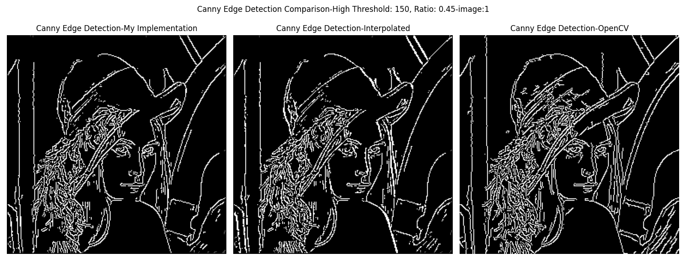
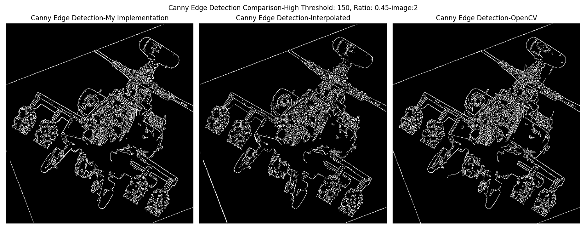
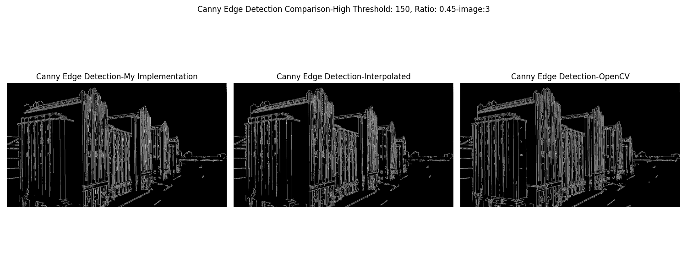

# Lab2-Canny边缘检测
* 学号：523030910022
* 姓名：郑钧澄
* 班级：电院2301

## 1. 实验概览
本次实验主要通过实现Canny边缘检测算法，来对一幅数字图像进行边缘检测，并同时与OpenCV-Python库中的`Canny()`函数的边缘检测效果进行对比。之后再通过设置不同的双阈值及不同的梯度算子，来对实现的Canny边缘检测的检测效果进行对比。
> 1. 图像边缘：图像局部区域亮度急剧变化的部分。
> 2. Canny边缘检测算法：
>    1. 平滑图像，消除噪声：使用高斯滤波器，函数为`cv2.GaussianBlur(img, (5, 5), 0.5)`
>    2. 计算每一点的梯度强度和梯度方向：使用`cv2.Sobel()`算子及`np.arctan2()`函数分别计算梯度和梯度方向
>    3. 通过非极大值抑制，消除边缘检测带来的杂散响应：分别使用**插值**与**非插值**算法进行非极大值抑制，并进行对比。
>    4. 通过双阈值检测，来确定潜在的边缘：通过设置高阈值`high_threshold`和阈值比率`ratio`，来获得低阈值`low_threshold = high_threshold * ratio`，以进行双阈值检测，检测强、弱边缘
>    5. 通过抑制孤立的弱边缘来完成检测：抑制孤立的弱边缘，将与强边缘连接的弱边缘设置成强边缘，以实现边缘连接(edge tracking)，最终完成边缘检测


## 2. 解决思路及核心代码

### 2.1. 平滑图像

使用OpenCV-Python库中的高斯模糊函数`cv2.GaussianBlur(img, (5, 5), 0.5)`对`img`进行平滑处理，这里使用的高斯核函数的大小为$5 \times 5$(因为在调试代码过程中，发现$5\times 5$的高斯核函数对于最终结果的呈现相比于$3 \times 3$的核函数效果要好)

代码如下：
``````python
img_blur = cv2.GaussianBlur(img_gray, (5, 5), 0.5)
``````


### 2.2. 计算梯度强度和梯度方向
1. 使用OpenCV-Python库中的`cv2.Sobel()`算子进行梯度强度的计算。其中数据类型为`cv2.CV_16S`，即16位有符号数据，来存储负值和大于255的数据，并在之后使用`cv2.convertScaleAbs()`进行数据转换，以得到正的梯度值。

2. 对于梯度强度计算：我将梯度值转换成`uint16`类型，是为了在之后计算梯度强度时防止`uint8`类型无法完整存储范围在`[0, 361]`间的梯度强度值。

3. 对于梯度方向的计算：在函数`np.arctan2()`中我并没有使用正值的梯度，因为这样可以让角度的范围限制在$(- \tfrac{\pi}{2}, \tfrac{\pi}{2})$中，在之后的处理中可以通过转换成角度后对180度取余（即`angle = np.rad2deg(angle) % 180`），可以让角度的范围被限制在$[0, \pi) \backslash \{\tfrac{\pi}{2}\}$中。

代码如下：
``````python
def sobel_gradients(img):
    # Use Sobel operator to get the gradients
    grad_x = cv2.Sobel(img, cv2.CV_16S, 1, 0, ksize=3)
    grad_y = cv2.Sobel(img, cv2.CV_16S, 0, 1, ksize=3)

    # Convert the gradients to absolute values
    grad_x_abs = cv2.convertScaleAbs(grad_x)
    grad_y_abs = cv2.convertScaleAbs(grad_y)

    # Convert the gradients to float32
    grad_x_abs = np.uint16(grad_x_abs)
    grad_y_abs = np.uint16(grad_y_abs)

    # Calculate the magnitude of the gradients and the angle
    magnitude = np.sqrt(grad_x_abs**2 + grad_y_abs**2)
    angle = np.arctan2(grad_y, grad_x)
    angle = np.rad2deg(angle) % 180

    return magnitude, angle
``````

### 2.3. 非极大值抑制

在这步中，我使用了两种方法进行非极大值抑制：**插值**与**非插值**算法。当被比较的数均大于两个比较数时，被比较的点为强边缘，保留原始梯度强度，其余情况均为弱边缘，设置成0。

1. **非插值**算法：分为四种对比情况：
    * `(0 <= angle[i, j] < 22.5) or (157.5 <= angle[i, j] <= 180)`：与左右相邻两点进行比较
    * `22.5 <= angle[i, j] < 67.5`：与左上方和右下方的点进行比较
    * `67.5 <= angle[i, j] < 112.5`：与正上方和正下方的点进行比较
    * `112.5 <= angle[i, j] < 157.5`：与右上方和左下方的点进行比较
2. **插值**算法：分为八种情况：
    * 前四种为角度为0，45，90，135度的情况，分别与左右、左上右下、上下、左下右上的点进行比较
    * 后四种使用线性插值方法，插值计算函数为`interpolate(M1, M2, w)`，`M1, M2`为两个梯度强度值，`w`为权重，在这里$w = \tfrac{dist(dtmp_1, p_1)}{dist(p_1, p_2)} = dist(dtmp_1, p_1)$，$dtmp_1$为插值结果对应的点，$p_i$为梯度强度为$M_i$的点，距离可以用角度的正切值或余切值来表示。四种情况`angle[i, j]`的取值范围分别为：
        - `(0, 45)`：$dtmp_1$对应的$p_1, p_2$分别为左、左上的点，$dtmp_2$对应的$p_1, p_2$分别为右、右下的点，`w = np.tan(np.deg2rad(angle[i, j]))`
        - `(45, 90)`：$dtmp_1$对应的$p_1, p_2$分别为上、左上的点，$dtmp_2$对应的$p_1, p_2$分别为下、右下的点，`w = 1 / np.tan(np.deg2rad(angle[i, j]))`
        - `(90, 135)`：$dtmp_1$对应的$p_1, p_2$分别为上、右上的点，$dtmp_2$对应的$p_1, p_2$分别为下、左下的点，`w = - 1 / np.tan(np.deg2rad(angle[i, j]))`
        - `(135, 180)`：$dtmp_1$对应的$p_1, p_2$分别为右、右上的点，$dtmp_2$对应的$p_1, p_2$分别为左、左下的点，`w = - np.tan(np.deg2rad(angle[i, j]))`

代码如下：
``````python
def non_max_suppression(magnitude, angle):
    # Non-maximum suppression
    M, N = magnitude.shape
    suppressed = np.zeros((M, N), dtype=np.float32)

    for i in range(1, M - 1):
        for j in range(1, N - 1):
            q = 255
            r = 255
            if (0 <= angle[i, j] < 22.5) or (157.5 <= angle[i, j] <= 180):
                q = magnitude[i, j + 1]
                r = magnitude[i, j - 1]
            elif 22.5 <= angle[i, j] < 67.5:
                q = magnitude[i - 1, j - 1]
                r = magnitude[i + 1, j + 1]
            elif 67.5 <= angle[i, j] < 112.5:
                q = magnitude[i - 1, j]
                r = magnitude[i + 1, j]
            elif 112.5 <= angle[i, j] < 157.5:
                q = magnitude[i + 1, j - 1]
                r = magnitude[i - 1, j + 1]

            if magnitude[i, j] >= q and magnitude[i, j] >= r:
                suppressed[i, j] = magnitude[i, j]
    return suppressed
``````

``````python
def interpolate(M1, M2, w):
    # Calculate the interpolated value
    return M1 * w + M2 * (1 - w)

def non_max_suppression_interpolated(magnitude, angle):
    # Non-maximum suppression with interpolation
    rows, cols = magnitude.shape
    suppressed_interpolated = np.zeros((rows, cols), dtype=np.float32)

    # Interpolated
    for i in range(1, rows - 1):
        for j in range(1, cols - 1):

            # Check the angle
            if angle[i, j] == 0:
                if magnitude[i, j] > magnitude[i, j - 1] and magnitude[i, j] > magnitude[i, j + 1]:
                    suppressed_interpolated[i, j] = magnitude[i, j]
            elif angle[i, j] == 135:
                if magnitude[i, j] > magnitude[i - 1, j + 1] and magnitude[i, j] > magnitude[i + 1, j - 1]:
                    suppressed_interpolated[i, j] = magnitude[i, j]
            elif angle[i, j] == 90:
                if magnitude[i, j] > magnitude[i - 1, j] and magnitude[i, j] > magnitude[i + 1, j]:
                    suppressed_interpolated[i, j] = magnitude[i, j]
            elif angle[i, j] == 45:
                if magnitude[i, j] > magnitude[i - 1, j - 1] and magnitude[i, j] > magnitude[i + 1, j + 1]:
                    suppressed_interpolated[i, j] = magnitude[i, j]
            elif 0 < angle[i, j] < 45:
                w = np.tan(np.deg2rad(angle[i, j]))
                dtmp1_mag = interpolate(magnitude[i, j - 1], magnitude[i - 1, j - 1], w)
                dtmp2_mag = interpolate(magnitude[i, j + 1], magnitude[i + 1, j + 1], w)
                if magnitude[i, j] > dtmp1_mag and magnitude[i, j] > dtmp2_mag:
                    suppressed_interpolated[i, j] = magnitude[i, j]
            elif 45 < angle[i, j] < 90:
                w = 1 / np.tan(np.deg2rad(angle[i, j]))
                dtmp1_mag = interpolate(magnitude[i - 1, j], magnitude[i - 1, j - 1], w)
                dtmp2_mag = interpolate(magnitude[i + 1, j], magnitude[i + 1, j + 1], w)
                if magnitude[i, j] > dtmp1_mag and magnitude[i, j] > dtmp2_mag:
                    suppressed_interpolated[i, j] = magnitude[i, j]
            elif 90 < angle[i, j] < 135:
                w = -1 / np.tan(np.deg2rad(angle[i, j]))
                dtmp1_mag = interpolate(magnitude[i - 1, j], magnitude[i - 1, j + 1], w)
                dtmp2_mag = interpolate(magnitude[i + 1, j], magnitude[i + 1, j - 1], w)
                if magnitude[i, j] > dtmp1_mag and magnitude[i, j] > dtmp2_mag:
                    suppressed_interpolated[i, j] = magnitude[i, j]
            elif 135 < angle[i, j] < 180:
                w = -np.tan(np.deg2rad(angle[i, j]))
                dtmp1_mag = interpolate(magnitude[i, j - 1], magnitude[i - 1, j + 1], w)
                dtmp2_mag = interpolate(magnitude[i, j + 1], magnitude[i + 1, j - 1], w)
                if magnitude[i, j] > dtmp1_mag and magnitude[i, j] > dtmp2_mag:
                    suppressed_interpolated[i, j] = magnitude[i, j]

    return suppressed_interpolated
``````

### 2.4. 双阈值检测

在此步中，需设置高低阈值来对经过非极大值抑制后的图像进行处理，这里的`strong`与`weak`仅为标志强、弱边缘的标志。这里我使用`np.where(condition)`方法找到图像中符合`condition`的坐标，并进行标志：

* 大于高阈值设置为强边缘
* 低于低阈值设置为0
* 在二者之间设置为弱边缘

代码如下：
``````python
def double_threshold(img, low_threshold, high_threshold):
    # Double threshold
    strong = 255
    weak = 75

    # Get the strong, weak, and zeros pixels' indices
    strong_i, strong_j = np.where(img >= high_threshold)
    weak_i, weak_j = np.where((img >= low_threshold) & (img < high_threshold))
    zeros_i, zeros_j = np.where(img < low_threshold)

    # Set the pixels to strong, weak, and zeros
    img[strong_i, strong_j] = strong
    img[weak_i, weak_j] = weak
    img[zeros_i, zeros_j] = 0

    return img, weak, strong
``````

### 2.5. 边缘连接

在此步中，我需要对弱边缘进行检测，若满足以下条件即将其像素值设置为0：

* 在以其为中心的$7 \times 7$格子中无强边缘

反之设置为255。完成此步后，即完成Canny边缘检测。

代码如下：
``````python
def edge_tracking(img, weak, strong=255):
    # Edge tracking
    M, N = img.shape
    for i in range(3, M - 3):
        for j in range(3, N - 3):
            if img[i, j] == weak:
                if strong in [img[i + a, j + b] for a in [-3, -2, -1, 0, 1, 2, 3] for b in [-3, -2, -1, 0, 1, 2, 3]]:
                    img[i, j] = strong
                else:
                    img[i, j] = 0
    return img
``````

### 2.6. Canny边缘检测

合并上述5个步骤后，即得到简化的Canny边缘检测：

``````python
def canny_edge_detection(img, low_threshold, high_threshold):
    # Canny edge detection algorithm
    # Convert the image to grayscale
    img_gray = cv2.cvtColor(img, cv2.COLOR_BGR2GRAY)

    # Apply Gaussian blur
    img_blur = cv2.GaussianBlur(img_gray, (5, 5), .5)

    # Get the gradients and angles
    magnitude, angles = sobel_gradients(img_blur)

    # Non-maximum suppression
    suppressed = non_max_suppression(magnitude, angles)

    # Double threshold
    thresholded, weak, strong = double_threshold(suppressed, low_threshold, high_threshold)

    # Edge tracking
    edges = edge_tracking(thresholded, weak, strong)

    return edges
``````

``````python
def canny_edge_detection_interpolated(img, low_threshold, high_threshold):
    # Canny edge detection algorithm with interpolatation
    # Convert the image to grayscale
    img_gray = cv2.cvtColor(img, cv2.COLOR_BGR2GRAY)

    # Apply Gaussian blur
    img_blur = cv2.GaussianBlur(img_gray, (5, 5), 0.5)

    # Get the gradients and angles
    magnitude, angles = sobel_gradients(img_blur)

    # Non-maximum suppression
    suppressed = non_max_suppression_interpolated(magnitude, angles)
    plt.figure()

    # Double threshold
    thresholded, weak, strong = double_threshold(suppressed, low_threshold, high_threshold)

    # Edge tracking
    edges = edge_tracking(thresholded, weak, strong)

    return edges
``````

## 3. 代码运行结果

### 3.1 Canny边缘检测效果
* 高阈值：150，比率：0.45







### 3.2. 不同双阈值下的Canny边缘检测效果

以图像1为例：

* 高阈值：150，比率：0.4, 0.45, 0.5


* 高阈值：140, 150, 160，比率：0.45


### 3.3. 不同梯度算子下的Canny边缘检测效果

这里我使用了三种不同的梯度算子：Sobel算子、Scarr算子和laplacian算子，来对同一幅图像进行Canny边缘检测。（高阈值：150，比率：0.45）


## 4. 实验结果分析与思考

### 4.1. Canny边缘检测效果分析

这里选择自己实现的Canny检测效果最好的图像进行分析：参数为高阈值150，比率0.45，使用Sobel算子。

* **无插值**算法下的Canny边缘检测效果：

    * 优点：三幅图像综合来看，边缘检测较为完整，整体结构比较清晰，边缘检测效果较好
    * 缺点：相比于OpenCV库中的Canny函数，边缘检测效果较差，边缘检测不够完整，部分边缘检测不到位，并且边缘连接不够完整，噪声较多

* **插值**算法下的Canny边缘检测效果：

    * 优点：三幅图像综合来看，边缘比较平滑，过渡比较自然，在某些地方较为明亮，噪声抑制效果比无插值算法更好，噪声点更少，细节较为丰富。
    * 缺点：相比于OpenCV库中的Canny函数，还是存在一定的噪声，并且与无插值算法相同，部分边缘检测不到位，边缘连接还是不够完整，断裂现象较多，部分弱边缘无法检测到。

* 综合分析：

    * 自己实现的两种Canny边缘检测效果都可以满足一般的边缘检测需求，并且在对细节要求不高、噪声较少的情况下，自己实现的Canny边缘检测效果较好，但是在对细节要求较高、噪声较多的情况下，OpenCV库中的Canny函数效果更好。
    * 使用了**插值**算法的边缘检测效果相较于**无插值**算法更好，噪声抑制效果更好，对比明显处的边缘检测效果更好，部分区域更为明亮（强边缘分布更密集），细节更为丰富，但是仍然存在部分弱边缘无法检测到的问题，边缘连接不够完整，噪声较多。
    * 两种算法的边缘检测效果都不如OpenCV库中的Canny函数，这可能是因为OpenCV库中的Canny函数使用了更为复杂的算法，对边缘检测效果更好，并且运行时间方面，OpenCV库中的Canny函数也更快。

### 4.2. 不同双阈值下的Canny边缘检测效果分析

以图像1为例：

* 选择高阈值为150，比率分别为0.4、0.45、0.5的三种情况进行分析：可以发现，随着比率的增高，低阈值增高，检测结果的图像特征大体上没有明显的差异，但是弱边缘点减少，在一定程度上会导致部分弱边缘无法检测到，边缘连接不够完整，细节减少（图像右下方的细节随比率升高而减少），但是噪声点也会随之减少。

* 选择高阈值分别为140、150、160，比率为0.45的三种情况进行分析：可以发现，随着高阈值的增高，强边缘点减少，弱边缘点增多，在边缘检测中，能够转换到强边缘的弱边缘减少，因此边缘检测效果不够完整，部分弱边缘无法检测到，边缘连接不够完整，细节减少，但是噪声点也会随之减少，与比率增高的情况类似。

* 总结：在实际应用中，需要根据实际情况选择合适的高低阈值，以达到较好的边缘检测效果，一般情况下，高阈值越高，检测到的强边缘点越少，低阈值越高，检测到的弱边缘点越少，但是边缘检测效果不够完整，细节减少，噪声点也会随之减少。

### 4.3. 不同梯度算子下的Canny边缘检测效果分析

* 选择Sobel算子、Scarr算子和Laplacian算子，对同一幅图像进行Canny边缘检测，可以发现：
    * Sobel算子的边缘检测效果最好，边缘检测最为明显，噪声点最少，细节最丰富，边缘连接较为完整。
    * Scarr算子的边缘检测效果较差，噪声点较多，但是细节最多，边缘连接最完整。
    * Laplacian算子效果不好，边缘检测效果不够完整，噪声点较多，细节较少，边缘连接不够完整。

* 在实际应用中，选择Sobel算子最为合适。

## 5. 实验感想

### 5.1. 思考题

* PPT公式修改：PPT中非极大值抑制中插值算法中的插值公式应从

$$
M(dtmp_1) = w * M(g_2) + (1 - w) * M(g_1)
$$

   改为

$$
M(dtmp_1) = w * M(g_1) + (1 - w) * M(g_2)
$$

### 5.2. 实验心得

1. 通过本次实验，我对Canny边缘检测算法有了更深入的了解，对于Canny边缘检测算法的实现有了更深入的认识，同时学会使用了高斯滤波器、Sobel算子、插值算法、双阈值检测、边缘连接等技术，对于图像处理有了更深入的认识。

2. 在本次实验中，我通过对参数的不断修改，得到了最终效果相对较好的边缘检测结果，知道了如何调整参数来得到更好的边缘检测效果，对于实际应用中的参数选择有了更深入的认识。

3. 在本次实验中，较为多地使用了Numpy库中的函数，使我自己对Numpy库中的运算函数等有了更深入的了解。

4. 虽然本次实验中，最终得到的边缘检测结果还可以，但是相比于OpenCV库中的Canny函数，效果还是有一定差距，因此在实际应用中，还是更倾向于使用OpenCV库中的Canny函数，并且我还需要继续学习更多的图像处理算法，来提高自己的图像处理能力。


## 6. 附录

完整代码（无对比版，对比版因长度限制，请参见lab2_contrast.py）：
``````python
import cv2
import numpy as np
import os
import matplotlib.pyplot as plt

def sobel_gradients(img):
    # Use Sobel operator to get the gradients
    grad_x = cv2.Sobel(img, cv2.CV_16S, 1, 0, ksize=3)
    grad_y = cv2.Sobel(img, cv2.CV_16S, 0, 1, ksize=3)

    # Convert the gradients to absolute values
    grad_x_abs = cv2.convertScaleAbs(grad_x)
    grad_y_abs = cv2.convertScaleAbs(grad_y)

    # Convert the gradients to float32
    grad_x_abs = np.uint16(grad_x_abs)
    grad_y_abs = np.uint16(grad_y_abs)

    # Calculate the magnitude of the gradients and the angle
    magnitude = np.sqrt(grad_x_abs**2 + grad_y_abs**2)
    angle = np.arctan2(grad_y, grad_x)
    angle = np.rad2deg(angle) % 180

    return magnitude, angle

def interpolate(M1, M2, w):
    # Calculate the interpolated value
    return M1 * w + M2 * (1 - w)

def non_max_suppression_interpolated(magnitude, angle):
    # Non-maximum suppression with interpolation
    rows, cols = magnitude.shape
    suppressed_interpolated = np.zeros((rows, cols), dtype=np.float32)

    # Interpolated
    for i in range(1, rows - 1):
        for j in range(1, cols - 1):

            # Check the angle
            if angle[i, j] == 0:
                if magnitude[i, j] > magnitude[i, j - 1] and magnitude[i, j] > magnitude[i, j + 1]:
                    suppressed_interpolated[i, j] = magnitude[i, j]
            elif angle[i, j] == 135:
                if magnitude[i, j] > magnitude[i - 1, j + 1] and magnitude[i, j] > magnitude[i + 1, j - 1]:
                    suppressed_interpolated[i, j] = magnitude[i, j]
            elif angle[i, j] == 90:
                if magnitude[i, j] > magnitude[i - 1, j] and magnitude[i, j] > magnitude[i + 1, j]:
                    suppressed_interpolated[i, j] = magnitude[i, j]
            elif angle[i, j] == 45:
                if magnitude[i, j] > magnitude[i - 1, j - 1] and magnitude[i, j] > magnitude[i + 1, j + 1]:
                    suppressed_interpolated[i, j] = magnitude[i, j]
            elif 0 < angle[i, j] < 45:
                w = np.tan(np.deg2rad(angle[i, j]))
                dtmp1_mag = interpolate(magnitude[i, j - 1], magnitude[i - 1, j - 1], w)
                dtmp2_mag = interpolate(magnitude[i, j + 1], magnitude[i + 1, j + 1], w)
                if magnitude[i, j] > dtmp1_mag and magnitude[i, j] > dtmp2_mag:
                    suppressed_interpolated[i, j] = magnitude[i, j]
            elif 45 < angle[i, j] < 90:
                w = 1 / np.tan(np.deg2rad(angle[i, j]))
                dtmp1_mag = interpolate(magnitude[i - 1, j], magnitude[i - 1, j - 1], w)
                dtmp2_mag = interpolate(magnitude[i + 1, j], magnitude[i + 1, j + 1], w)
                if magnitude[i, j] > dtmp1_mag and magnitude[i, j] > dtmp2_mag:
                    suppressed_interpolated[i, j] = magnitude[i, j]
            elif 90 < angle[i, j] < 135:
                w = -1 / np.tan(np.deg2rad(angle[i, j]))
                dtmp1_mag = interpolate(magnitude[i - 1, j], magnitude[i - 1, j + 1], w)
                dtmp2_mag = interpolate(magnitude[i + 1, j], magnitude[i + 1, j - 1], w)
                if magnitude[i, j] > dtmp1_mag and magnitude[i, j] > dtmp2_mag:
                    suppressed_interpolated[i, j] = magnitude[i, j]
            elif 135 < angle[i, j] < 180:
                w = -np.tan(np.deg2rad(angle[i, j]))
                dtmp1_mag = interpolate(magnitude[i, j - 1], magnitude[i - 1, j + 1], w)
                dtmp2_mag = interpolate(magnitude[i, j + 1], magnitude[i + 1, j - 1], w)
                if magnitude[i, j] > dtmp1_mag and magnitude[i, j] > dtmp2_mag:
                    suppressed_interpolated[i, j] = magnitude[i, j]

    return suppressed_interpolated


def non_max_suppression(magnitude, angle):
    # Non-maximum suppression
    M, N = magnitude.shape
    suppressed = np.zeros((M, N), dtype=np.float32)

    for i in range(1, M - 1):
        for j in range(1, N - 1):
            q = 255
            r = 255
            if (0 <= angle[i, j] < 22.5) or (157.5 <= angle[i, j] <= 180):
                q = magnitude[i, j + 1]
                r = magnitude[i, j - 1]
            elif 22.5 <= angle[i, j] < 67.5:
                q = magnitude[i - 1, j - 1]
                r = magnitude[i + 1, j + 1]
            elif 67.5 <= angle[i, j] < 112.5:
                q = magnitude[i - 1, j]
                r = magnitude[i + 1, j]
            elif 112.5 <= angle[i, j] < 157.5:
                q = magnitude[i + 1, j - 1]
                r = magnitude[i - 1, j + 1]

            if magnitude[i, j] >= q and magnitude[i, j] >= r:
                suppressed[i, j] = magnitude[i, j]
    return suppressed

def double_threshold(img, low_threshold, high_threshold):
    # Double threshold
    strong = 255
    weak = 75

    # Get the strong, weak, and zeros pixels' indices
    strong_i, strong_j = np.where(img >= high_threshold)
    weak_i, weak_j = np.where((img >= low_threshold) & (img < high_threshold))
    zeros_i, zeros_j = np.where(img < low_threshold)

    # Set the pixels to strong, weak, and zeros
    img[strong_i, strong_j] = strong
    img[weak_i, weak_j] = weak
    img[zeros_i, zeros_j] = 0

    return img, weak, strong

def edge_tracking(img, weak, strong=255):
    # Edge tracking
    M, N = img.shape
    for i in range(3, M - 3):
        for j in range(3, N - 3):
            if img[i, j] == weak:
                if strong in [img[i + a, j + b] for a in [-3, -2, -1, 0, 1, 2, 3] for b in [-3, -2, -1, 0, 1, 2, 3]]:
                    img[i, j] = strong
                else:
                    img[i, j] = 0
    return img

def canny_edge_detection(img, low_threshold, high_threshold):
    # Canny edge detection algorithm
    # Convert the image to grayscale
    img_gray = cv2.cvtColor(img, cv2.COLOR_BGR2GRAY)

    # Apply Gaussian blur
    img_blur = cv2.GaussianBlur(img_gray, (5, 5), .5)

    # Get the gradients and angles
    magnitude, angles = sobel_gradients(img_blur)

    # Non-maximum suppression
    suppressed = non_max_suppression(magnitude, angles)

    # Double threshold
    thresholded, weak, strong = double_threshold(suppressed, low_threshold, high_threshold)

    # Edge tracking
    edges = edge_tracking(thresholded, weak, strong)

    return edges

def canny_edge_detection_interpolated(img, low_threshold, high_threshold):
    # Canny edge detection algorithm with interpolataion
    # Convert the image to grayscale
    img_gray = cv2.cvtColor(img, cv2.COLOR_BGR2GRAY)

    # Apply Gaussian blur
    img_blur = cv2.GaussianBlur(img_gray, (5, 5), 0.5)

    # Get the gradients and angles
    magnitude, angles = sobel_gradients(img_blur)

    # Non-maximum suppression
    suppressed = non_max_suppression_interpolated(magnitude, angles)
    plt.figure()

    # Double threshold
    thresholded, weak, strong = double_threshold(suppressed, low_threshold, high_threshold)

    # Edge tracking
    edges = edge_tracking(thresholded, weak, strong)

    return edges


if __name__ == '__main__':
    # Get the path of the current working directory
    current_working_dir = os.path.dirname(__file__)
    imgs_path = os.path.join(current_working_dir, 'img')

    # Make output directory
    output_path = os.path.join(current_working_dir, 'output')
    os.makedirs(output_path, exist_ok=True)

    # Iterate over the images
    imgs = ('1.jpg', '2.jpg', '3.jpg')

    # Set the high threshold and the ratio
    h_th = 150
    ratio = 0.4
    l_th = int(ratio * h_th)

    for index, i in enumerate(imgs):
        img = cv2.imread(os.path.join(imgs_path, i))
        edges_low = canny_edge_detection(img, low_threshold=l_th, high_threshold=h_th)
        edges_interpolated = canny_edge_detection_interpolated(img, low_threshold=l_th, high_threshold=h_th)
        edge = cv2.Canny(img, l_th, h_th)

        plt.figure(figsize=(15, 6))
        plt.subplot(1, 3, 1)
        plt.imshow(edges_low, cmap='gray')
        plt.title('Canny Edge Detection-My Implementation')
        plt.axis('off')

        plt.subplot(1, 3, 2)
        plt.imshow(edges_interpolated, cmap='gray')
        plt.title('Canny Edge Detection-Interpolated')
        plt.axis('off')

        plt.subplot(1, 3, 3)
        plt.imshow(edge, cmap='gray')
        plt.title('Canny Edge Detection-OpenCV')
        plt.axis('off')

        plt.suptitle(f'Canny Edge Detection Comparison-High Threshold: {h_th}, Ratio: {ratio}-image:{index+1}')
        plt.tight_layout()
        plt.savefig(os.path.join(output_path, f'canny_edge_detection_image{index+1}_HighThreshold_{h_th}_Ratio_{ratio}.png'))
        plt.close()
``````