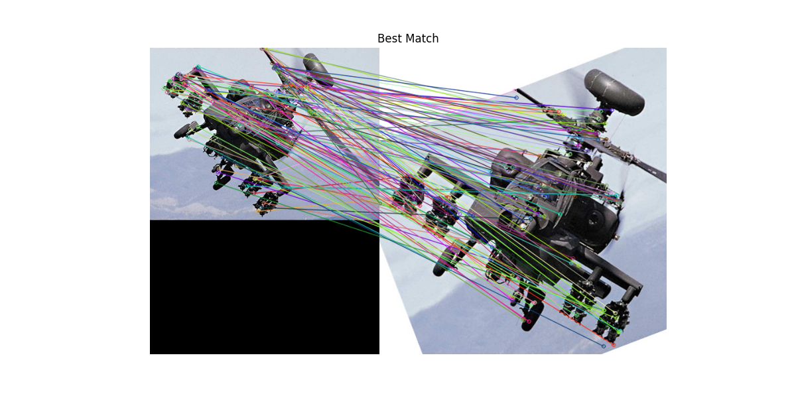
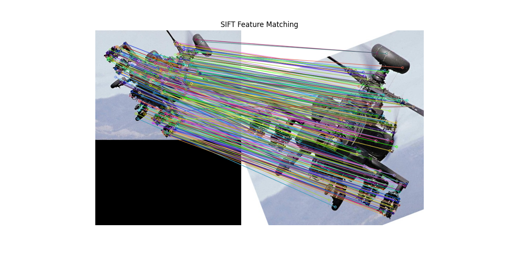

# Lab3-SIFT
## 1. 实验概览

本次实验主要是对SIFT算法的实现，以及与OpenCV中的SIFT算法进行对比。实验中主要包括以下几个部分：

1. SIFT算法的实现:
    * 构建高斯金字塔，并进行多尺度Harris角点检测
    * 计算SIFT描述子
    * 特征点匹配
    * 找到最佳匹配点对并绘制匹配结果
2. 与OpenCV中的SIFT算法进行对比

## 2. 解决思路及核心代码

### 2.1. 构建高斯金字塔，并进行多尺度Harris角点检测

#### 2.1.1 构建高斯金字塔

在构建高斯金字塔时，首先确定金字塔的层数`levels`和缩放比例`scale_factor`，然后使用`cv2.resize()`函数进行图像的缩放（这里仅对图像做了下缩放），然后将图像存入金字塔中，得到高斯金字塔。

主要代码实现如下函数`build_image_pyramid`所示，其中`cv2.resize`函数中插值方法使用了`cv2.INTER_LANCZOS4`的Lanczos插值方法以做到高质量的图像缩放：

``````python
def build_image_pyramid(image, levels, scale_factor=0.5):
    """图像金字塔构建"""
    pyramid = [image]
    current_image = image
    for i in range(1, levels):
        # 使用 cv2.resize 进行下采样
        new_width = int(current_image.shape[1] * scale_factor)
        new_height = int(current_image.shape[0] * scale_factor)
        current_image = cv2.resize(current_image, (new_width, new_height), interpolation=cv2.INTER_LINEAR)
        pyramid.append(current_image)

    return pyramid
``````

#### 2.1.2 多尺度Harris角点检测

在这一步中，首先对高斯金字塔中每一层的图像转换成灰色图像，然后使用`cv2.cornerHarris()`进行Harris角点检测，得到每一层的角点坐标。然后对每个角点进行阈值检测，留下满足`dst > threshold * dst.max()`的角点，并将其缩放到原图像坐标系中，得到最终的角点坐标。

核心代码如函数`multi_scale_harris_corner_detection`所示：

``````python
def multi_scale_harris_corner_detection(image, levels=3, scale_factor=0.5, block_size=2, ksize=3, k=0.1, threshold_ratio=0.01):
    """使用图像金字塔进行多尺度Harris角点检测"""
    pyramid = build_image_pyramid(image, levels, scale_factor=scale_factor)
    all_keypoints = []
    for level, img in enumerate(pyramid):
        gray = cv2.cvtColor(img, cv2.COLOR_BGR2GRAY) if len(img.shape) == 3 else img
        gray = np.float32(gray)
        dst = cv2.cornerHarris(gray, blockSize=block_size, ksize=ksize, k=k)
        threshold = threshold_ratio * dst.max()
        keypoints = np.argwhere(dst > threshold)
        for pt in keypoints:
            kp = cv2.KeyPoint(float(pt[1] * ((1 / scale_factor) ** level)), float(pt[0] * ((1 / scale_factor) ** level)), 1 * ((1 / scale_factor) ** level))
            all_keypoints.append(kp)
    return all_keypoints
``````

### 2.2. 计算SIFT描述子

1. 将图像转换为灰度图像
2. 对每一个关键点进行下列操作：
    1. 使用Sobel算子，对关键点周围的16x16的区域进行梯度计算，得到梯度幅度`magnitude`和方向`angle`，并使用`np.rad2deg()`将方向转换到0-360度之间
    2. 计算关键点的主方向：在关键点周围的16x16区域内，统计每个方向的梯度直方图，找到直方图中数值最大的方向，作为关键点的主方向`main_orientation`，并得到物体坐标系下的角度`obj_angle = angle[8, 8] - main_orientation`
    3. 构建SIFT描述子：在关键点的物体坐标系周围的$16\times 16$区域内，将区域分为$4\times 4$个子区域，对每个子区域的坐标从物体坐标系转换到图像坐标系中，然后使用双线性插值法`bilinear_interpolate()`函数来计算8个方向($0 \sim 359^{\circ}$平均分为8个区间)的梯度直方图，得到一个$4\times 4 \times 8=128$维的SIFT描述子，最后对描述子进行归一化处理，得到最终的SIFT描述子。

核心代码如函数`compute_sift_descriptor`所示：

其中：
* `bilinear_interpolate()`函数用于双线性插值：先获取目标位置的四个邻近点的像素值，然后根据目标位置与邻近点的距离进行插值计算。
* `compute_sift_descriptor()`函数用于计算SIFT描述子：对每一个关键点，首先提取关键点周围的梯度信息，然后计算关键点的主方向，最后构建SIFT描述子。
``````python
def bilinear_interpolate(image, x, y):
    """双线性插值"""
    # 确保目标位置在图像范围内
    x1 = max(int(np.floor(x)), 0)
    x1 = min(x1, image.shape[1] - 1)
    y1 = max(int(np.floor(y)), 0)
    y1 = min(y1, image.shape[0] - 1)

    x2 = min(x1 + 1, image.shape[1] - 1)
    y2 = min(y1 + 1, image.shape[0] - 1)

    # 获取四个邻近点的像素值
    Q11, Q21 = image[y1, x1], image[y1, x2]
    Q12, Q22 = image[y2, x1], image[y2, x2]

    # 计算插值
    dx1, dy1 = x - x1, y - y1
    dx2, dy2 = x2 - x, y2 - y
    P = Q11 * dx2 * dy2 + Q21 * dx1 * dy2 + Q12 * dx2 * dy1 + Q22 * dx1 * dy1

    return P

def compute_sift_descriptors(image, keypoints):
    """自己实现SIFT描述子的计算"""
    if len(image.shape) == 3:
        gray = cv2.cvtColor(image, cv2.COLOR_BGR2GRAY)
    else:
        gray = image
    
    gray = np.float32(gray)
    shape = gray.shape

    descriptors = []
    for kp in keypoints:
        x, y = int(kp.pt[0]), int(kp.pt[1])

        # 提取关键点邻域的梯度信息
        window = gray[max(0, y - 8): min(y + 8, shape[0]), max(0, x - 8): min(x + 8, shape[1])]
        if window.shape[0] < 16 or window.shape[1] < 16:
            continue

        # 计算梯度
        dx = cv2.Sobel(window, cv2.CV_32F, 1, 0, ksize=3)
        dy = cv2.Sobel(window, cv2.CV_32F, 0, 1, ksize=3)
        magnitude = np.sqrt(dx**2 + dy**2)
        angle = np.rad2deg(np.arctan2(dy, dx)) % 360

        # 计算关键点的主方向
        hist = np.zeros(36, dtype=np.float32)
        for i in range(magnitude.shape[0]):
            for j in range(magnitude.shape[1]):
                bin_idx = int(angle[i, j] // 10) % 36
                hist[bin_idx] += magnitude[i, j]
        main_orientation = np.argmax(hist) * 10
        obj_angle = angle[8, 8] - main_orientation

        # 构建SIFT描述子
        descriptor = []
        for i in range(0, 16, 4):
            for j in range(0, 16, 4):
                block_hist = np.zeros(8, dtype=np.float32)
                for m in range(4):
                    for n in range(4):
                        # 物体坐标系上的点
                        obj_x = j + n
                        obj_y = i + m

                        # 图像坐标系上的点
                        img_x = obj_x * np.cos(np.deg2rad(obj_angle)) - obj_y * np.sin(np.deg2rad(obj_angle))
                        img_y = obj_x * np.sin(np.deg2rad(obj_angle)) + obj_y * np.cos(np.deg2rad(obj_angle))

                        # 双线性插值
                        mag = bilinear_interpolate(magnitude, img_x, img_y)
                        ang = bilinear_interpolate(angle, img_x, img_y)

                        # 临近插值
                        # y1 = max(int(np.floor(img_y)), 0)
                        # y1 = min(y1, magnitude.shape[0] - 1)
                        # x1 = max(int(np.floor(img_x)), 0)
                        # x1 = min(x1, magnitude.shape[1] - 1)
                        # mag = magnitude[y1, x1]
                        # ang = angle[y1, x1]

                        ang = (ang + 360) % 360
                        bin_idx = int(ang // 45) % 8
                        block_hist[bin_idx] += mag
                descriptor.extend(block_hist)
        
        descriptor = np.array(descriptor, dtype=np.float32)
        descriptor /= np.linalg.norm(descriptor) + 1e-6
        descriptors.append(descriptor)

    return np.array(descriptors)
``````

### 2.3. 特征点匹配

在这一步骤中，首先先计算两幅图像的SIFT描述子，然后对于一幅图像中的每一个特征点，计算其与另一幅图像中所有特征点的距离`distance`，找到距离最近及此近的两个特征点，然后计算它们的距离比值，若比值小于阈值`ratio_threshold`，则认为匹配成功（这里进行等价变换，即对`best_distance < ratio_threshold * second_best_distance`进行计算，若返回`true`，则匹配成功）。

这里还引入了`matched`数组，用于存储匹配成功的特征点对，当一个特征点匹配成功后，会将其在`matched`数组中的位置标记为`True`，以避免重复匹配。

核心代码如函数`match_features`所示：

``````python
def match_features(descriptors1, descriptors2, ratio_threshold=0.75):
    matches = []
    matched = [False] * len(descriptors2)

    for i, desc1 in enumerate(descriptors1):
        best_match = None
        best_distance = float('inf')
        second_best_distance = float('inf')
        for j, desc2 in enumerate(descriptors2):
            if matched[j]:
                continue
            distance = np.linalg.norm(desc1 - desc2)
            if distance < best_distance:
                second_best_distance = best_distance
                best_distance = distance
                best_match = j
        if best_distance < ratio_threshold * second_best_distance:
            matches.append((i, best_match, best_distance))
            matched[best_match] = True

    print("Finish feature matching")
    return matches
``````

### 2.4. 找到最佳匹配点对并绘制匹配结果

在这一步骤中，使用匹配成功的关键点对的数量作为评价指标，遍历数据集中所有图片，找到最佳匹配图像对，然后使用`cv2.drawMatches()`函数绘制匹配结果。

核心代码如下所示：

``````python
best_match_image = None
best_match_keypoints = None
best_match_descriptors = None
best_matches = []
best_score = 0

# 遍历数据集中的所有图片
for i in range(1, 6):  # 数据集中有5张图片
    search_image = cv2.imread(os.path.join(cwd, 'img', f'{i}.jpg'))
    if search_image is None:
        print(f"无法读取 {i}.jpg")
        continue

    # 提取搜索图像的特征点和描述子
    search_keypoints = multi_scale_harris_corner_detection(search_image, levels=levels, block_size=block_size, ksize=ksize, k=k, threshold_ratio=threshold_ratio)
    search_descriptors = compute_sift_descriptors(search_image, search_keypoints)

    # 匹配特征点
    # 匹配的数量作为分数
    matches = match_features(target_descriptors, search_descriptors, ratio_threshold=ratio_threshold)

    score = len(matches)
    if score > best_score:
        best_score = score
        best_match_image = search_image
        best_match_keypoints = search_keypoints
        best_match_descriptors = search_descriptors
        best_matches = matches

# 绘制最佳匹配结果
if best_match_image is not None:
    result_image = cv2.drawMatches(
        best_match_image, best_match_keypoints,
        target_image, target_keypoints,
        [cv2.DMatch(_queryIdx=m[1], _trainIdx=m[0], _imgIdx=0, _distance=m[2]) for m in best_matches],
        None, flags=cv2.DrawMatchesFlags_NOT_DRAW_SINGLE_POINTS
    )
    
    # 使用Matplotlib显示图像
    plt.figure(figsize=(12, 6))
    plt.imshow(cv2.cvtColor(result_image, cv2.COLOR_BGR2RGB))
    plt.title("Best Match")
    plt.axis('off')
    plt.savefig(os.path.join(cwd, 'output', 'my_match.png'))
    plt.close()
else:
    print("未找到匹配的图像")
``````

### 2.5. 与OpenCV中的SIFT算法进行对比

在这一步骤中，使用OpenCV中的SIFT算法提取特征点和描述子，并绘制匹配结果，步骤为：

* 将图像转换为灰度图像
* 使用`cv2.SIFT_create()`创建SIFT对象
* 使用`detectAndCompute()`函数提取特征点和描述子
* 使用`BFMatcher()`暴力匹配器进行knn匹配，并进行比值测试，得到匹配结果
* 使用`cv2.drawMatches()`函数绘制匹配结果

核心代码如下所示：

``````python
def sift_feature_detection(image_path, target_image_path, output_path, ratio_threshold=0.75):
    """使用OpenCV的SIFT进行特征检测和匹配"""
    # 读取图像
    image = cv2.imread(image_path)
    target_image = cv2.imread(target_image_path)
    
    if image is None or target_image is None:
        print("无法读取图像")
        return

    # 转换为灰度图像
    gray_image = cv2.cvtColor(image, cv2.COLOR_BGR2GRAY)
    gray_target_image = cv2.cvtColor(target_image, cv2.COLOR_BGR2GRAY)

    # 创建SIFT对象
    sift = cv2.SIFT_create()

    # 检测关键点并计算描述子
    keypoints_image, descriptors_image = sift.detectAndCompute(gray_image, None)
    keypoints_target, descriptors_target = sift.detectAndCompute(gray_target_image, None)

    # 使用暴力匹配器进行匹配
    bf = cv2.BFMatcher(cv2.NORM_L2, crossCheck=False)

    # KNN匹配
    matches = bf.knnMatch(descriptors_image, descriptors_target, k=2)

    # 使用比率测试来过滤不好的匹配
    good_matches = []
    for m, n in matches:
        if m.distance < ratio_threshold * n.distance:
            good_matches.append(m)

    # 绘制匹配结果
    result_image = cv2.drawMatches(
        image, keypoints_image,
        target_image, keypoints_target,
        good_matches, None,
        flags=cv2.DrawMatchesFlags_NOT_DRAW_SINGLE_POINTS
    )

    # 显示匹配结果
    plt.figure(figsize=(12, 6))
    plt.imshow(cv2.cvtColor(result_image, cv2.COLOR_BGR2RGB))
    plt.title("SIFT Feature Matching")
    plt.axis('off')
    plt.savefig(os.path.join(output_path, 'sift_matching.png'))
    plt.close()

    return good_matches, keypoints_image, keypoints_target
``````

## 3. 实验结果及分析

### 3.1. 实验结果

* 使用自己实现的SIFT算法进行特征点匹配，得到的最佳匹配结果如下图所示，匹配上的关键点对数为131：



* 使用OpenCV中的SIFT算法进行特征点匹配，得到的最佳匹配结果如下图所示，匹配上的关键点对数为355:



### 3.2. 实验分析

* 从最终实验效果来看，自己实现的SIFT算法效果并不理想，配对点对数较少，匹配效果较差，无法做到有效的特征点匹配，同时在运行时间上也较长，这可能是因为：
    * 自己实现的SIFT算法中，使用了简化的高斯金字塔和多尺度Harris角点检测，这可能导致检测到的关键点较少，并且关键点的特征不明显，导致匹配效果较差。
    * 自己实现的SIFT描述子计算方法较为简单，并且在处理边界情况中并没有那么完善，这可能导致在计算SIFT描述子时无法很好地提取关键点的特征，导致匹配效果较差
    * 自己实现的特征点匹配算法中，只是简单地进行暴力枚举，没有使用更加高效的匹配算法，导致时间复杂度较高，匹配时间过长
* OpenCV中的SIFT算法效果较好，匹配效果较好，匹配点对数较多，匹配效果较好，同时在运行时间上也较短，这可能是因为：
    * OpenCV中的SIFT算法使用了更加复杂的高斯金字塔和多尺度Harris角点检测，能够更好地提取关键点的特征，提高匹配效果
    * OpenCV中的SIFT描述子计算方法更加复杂，能够更好地提取关键点的特征，提高匹配效果
    * OpenCV中的特征点匹配算法使用了更加高效的匹配算法knn匹配，能够更快地进行特征点匹配，提高匹配效果

在实验过程中，我还对参数的设置进行了不断的调整，包括高斯金字塔的层数`levels`、缩放比例`scale_factor`、Harris角点检测的参数`block_size`、`ksize`、`k`、`threshold_ratio`、特征点匹配的比值阈值`ratio_threshold`等，发现这些参数的设置对最终的匹配效果有很大的影响，不同的参数设置会导致不同的匹配效果，如：

* `ratio_threshold`的大小会影响匹配的精度，设置过大会导致匹配的特征点对数过多，设置过小会导致匹配的特征点对数过少，影响匹配效果，在实验中，我选择了0.75作为比值阈值，能够得到较好的匹配效果。
* `threshold_ratio`的大小会影响Harris角点检测的阈值，设置过大会导致检测到的角点过少，设置过小会导致检测到的角点过多，影响匹配效果，在实验中，我选择了0.01作为阈值比例，能够得到较好的匹配效果。
* `k`的大小会影响Harris角点检测的灵敏度，设置过大会导致检测到的角点过少，设置过小会导致检测到的角点过多，导致后续运行时间过长，影响匹配效果，在实验中，我选择了0.04作为k值，在保证检测到足够多角点的情况下，运行时间较短，匹配效果较好。

除了对参数的调整，我还使用了OpenCV-Python库中的`BFMatcher()`暴力匹配器进行knn匹配，并进行比值测试，得到匹配结果，但是最终结果并不理想，匹配点对数过少，匹配效果较差，这可能是在计算SIFT描述子时，提取的特征不够明显，导致匹配效果较差。

## 4. 实验感想

### 4.1. 实验收获

通过本次实验，我对SIFT算法有了更深入的了解，掌握了SIFT算法的基本原理和实现方法，学会了如何使用Python和OpenCV实现SIFT算法，并与OpenCV中的SIFT算法进行对比，从中学到了很多知识和技巧，收获颇丰。

### 4.2. 实验困难

在实验过程中，我遇到了一些困难，主要包括：

* SIFT算法的实现比较复杂，需要对图像金字塔、Harris角点检测、SIFT描述子等多个方面有深入的了解，因此在实现过程中花费了大量的时间和精力来调整算法和参数，最终得到的匹配效果也不是很理想。
* 在特征点匹配的过程中，匹配算法的选择和参数的设置对匹配效果有很大的影响，在尝试了自己实现的特征点匹配算法后，我尝试了OpenCV中的`BFMatcher()`暴力匹配器进行knn匹配，并进行比值测试，但是最终结果并不理想，因此最终只能选择自己实现的特征点匹配算法，代码运行时间较长。

### 4.3. 实验改进

如果可以对自己实现的SIFT算法进行改进，我觉得可以从以下几个方面进行改进：

* 对SIFT算法的实现进行优化，可以使用更加复杂的高斯金字塔和其他的关键点检测方法，以及更加复杂的SIFT描述子计算方法，提高匹配效果。
* 在特征点匹配的过程中，可以使用更加高效的匹配算法，如FLANN匹配器，来提高匹配效果。
* 进一步优化参数的设置，找到最佳参数设置来提高匹配效果。

总的来说，本次实验是一次很好的实践机会，通过实现SIFT算法并与OpenCV中的SIFT算法进行对比，我对SIFT算法有了更深入的了解，并学会了如何使用Python和OpenCV实现SIFT算法。

## 5. 附录：代码

``````python
import cv2
import numpy as np
import os
import matplotlib.pyplot as plt

def build_image_pyramid(image, levels, scale_factor=0.5):
    """图像金字塔构建"""
    pyramid = [image]
    current_image = image
    for i in range(1, levels):
        # 使用 cv2.resize 进行下采样
        new_width = int(current_image.shape[1] * scale_factor)
        new_height = int(current_image.shape[0] * scale_factor)
        current_image = cv2.resize(current_image, (new_width, new_height), interpolation=cv2.INTER_LANCZOS4)
        pyramid.append(current_image)

    return pyramid

def multi_scale_harris_corner_detection(image, levels=3, scale_factor=0.5, block_size=2, ksize=3, k=0.1, threshold_ratio=0.01):
    """使用图像金字塔进行多尺度Harris角点检测"""
    pyramid = build_image_pyramid(image, levels, scale_factor=scale_factor)
    all_keypoints = []
    for level, img in enumerate(pyramid):
        gray = cv2.cvtColor(img, cv2.COLOR_BGR2GRAY) if len(img.shape) == 3 else img
        gray = np.float32(gray)
        dst = cv2.cornerHarris(gray, blockSize=block_size, ksize=ksize, k=k)
        threshold = threshold_ratio * dst.max()
        keypoints = np.argwhere(dst > threshold)
        for pt in keypoints:
            kp = cv2.KeyPoint(float(pt[1] * ((1 / scale_factor) ** level)), float(pt[0] * ((1 / scale_factor) ** level)), 1 * ((1 / scale_factor) ** level))
            all_keypoints.append(kp)
    print("Finish multi-scale Harris corner detection")
    return all_keypoints

def bilinear_interpolate(image, x, y):
    """双线性插值"""
    # 确保目标位置在图像范围内
    x1 = max(int(np.floor(x)), 0)
    x1 = min(x1, image.shape[1] - 1)
    y1 = max(int(np.floor(y)), 0)
    y1 = min(y1, image.shape[0] - 1)

    x2 = min(x1 + 1, image.shape[1] - 1)
    y2 = min(y1 + 1, image.shape[0] - 1)

    # 获取四个邻近点的像素值
    Q11, Q21 = image[y1, x1], image[y1, x2]
    Q12, Q22 = image[y2, x1], image[y2, x2]

    # 计算插值
    dx1, dy1 = x - x1, y - y1
    dx2, dy2 = x2 - x, y2 - y
    P = Q11 * dx2 * dy2 + Q21 * dx1 * dy2 + Q12 * dx2 * dy1 + Q22 * dx1 * dy1

    return P

def compute_sift_descriptors(image, keypoints):
    """自己实现SIFT描述子的计算"""
    if len(image.shape) == 3:
        gray = cv2.cvtColor(image, cv2.COLOR_BGR2GRAY)
    else:
        gray = image
    
    gray = np.float32(gray)
    shape = gray.shape

    descriptors = []
    for kp in keypoints:
        x, y = int(kp.pt[0]), int(kp.pt[1])

        # 提取关键点邻域的梯度信息
        window = gray[max(0, y - 8): min(y + 8, shape[0]), max(0, x - 8): min(x + 8, shape[1])]
        if window.shape[0] < 16 or window.shape[1] < 16:
            continue

        # 计算梯度
        dx = cv2.Sobel(window, cv2.CV_32F, 1, 0, ksize=3)
        dy = cv2.Sobel(window, cv2.CV_32F, 0, 1, ksize=3)
        magnitude = np.sqrt(dx**2 + dy**2)
        angle = np.rad2deg(np.arctan2(dy, dx)) % 360

        # 计算关键点的主方向
        hist = np.zeros(36, dtype=np.float32)
        for i in range(magnitude.shape[0]):
            for j in range(magnitude.shape[1]):
                bin_idx = int(angle[i, j] // 10) % 36
                hist[bin_idx] += magnitude[i, j]
        main_orientation = np.argmax(hist) * 10
        obj_angle = angle[8, 8] - main_orientation

        # 构建SIFT描述子
        descriptor = []
        for i in range(0, 16, 4):
            for j in range(0, 16, 4):
                block_hist = np.zeros(8, dtype=np.float32)
                for m in range(4):
                    for n in range(4):
                        # 物体坐标系上的点
                        obj_x = j + n
                        obj_y = i + m

                        # 图像坐标系上的点
                        img_x = obj_x * np.cos(np.deg2rad(obj_angle)) - obj_y * np.sin(np.deg2rad(obj_angle))
                        img_y = obj_x * np.sin(np.deg2rad(obj_angle)) + obj_y * np.cos(np.deg2rad(obj_angle))

                        # 双线性插值
                        mag = bilinear_interpolate(magnitude, img_x, img_y)
                        ang = bilinear_interpolate(angle, img_x, img_y)

                        ang = (ang + 360) % 360
                        bin_idx = int(ang // 45) % 8
                        block_hist[bin_idx] += mag
                descriptor.extend(block_hist)
        
        descriptor = np.array(descriptor, dtype=np.float32)
        descriptor /= np.linalg.norm(descriptor) + 1e-6
        descriptors.append(descriptor)

    print("Finish SIFT descriptor computation")
    return np.array(descriptors)

def match_features(descriptors1, descriptors2, ratio_threshold=0.75):
    matches = []
    matched = [False] * len(descriptors2)

    for i, desc1 in enumerate(descriptors1):
        best_match = None
        best_distance = float('inf')
        second_best_distance = float('inf')
        for j, desc2 in enumerate(descriptors2):
            if matched[j]:
                continue
            distance = np.linalg.norm(desc1 - desc2)
            if distance < best_distance:
                second_best_distance = best_distance
                best_distance = distance
                best_match = j
        if best_distance < ratio_threshold * second_best_distance:
            matches.append((i, best_match, best_distance))
            matched[best_match] = True

    print("Finish feature matching")
    return matches

def match_features_BFMatcher(descriptors1, descriptors2, ratio_threshold=0.75):
    """使用BFMatcher进行特征匹配"""
    bf = cv2.BFMatcher(cv2.NORM_L2, crossCheck=False)

    # 使用KNN进行匹配，k=2返回两个最佳匹配
    matches = bf.knnMatch(descriptors1, descriptors2, k=2)

    good_matches = []
    for m, n in matches:
        # 比率测试：距离最小的匹配与第二小匹配的距离比率
        if m.distance < ratio_threshold * n.distance:
            good_matches.append(m)

    print("Finish feature matching")
    return good_matches

def main(ratio_threshold=0.75, levels=3, scale_factor=0.3, block_size=2, ksize=3, k=0.04, threshold_ratio=0.01):
    cwd = os.path.dirname(__file__)
    # 读取目标图像
    target_image = cv2.imread(os.path.join(cwd, 'img', 'target.jpg'))
    if target_image is None:
        print("无法读取目标图像")
        return

    # 提取目标图像的特征点和描述子
    # target_keypoints = harris_corner_detection(target_image)
    target_keypoints = multi_scale_harris_corner_detection(target_image, levels=levels, scale_factor=scale_factor, block_size=block_size, ksize=ksize, k=k, threshold_ratio=threshold_ratio)
    target_descriptors = compute_sift_descriptors(target_image, target_keypoints)

    best_match_image = None
    best_match_keypoints = None
    best_match_descriptors = None
    best_matches = []
    best_score1 = float('inf')
    best_score2 = 0

    # 遍历数据集中的所有图片
    for i in range(1, 6):  # 数据集中有5张图片
        search_image = cv2.imread(os.path.join(cwd, 'img', f'{i}.jpg'))
        if search_image is None:
            print(f"无法读取 {i}.jpg")
            continue

        # 提取搜索图像的特征点和描述子
        search_keypoints = multi_scale_harris_corner_detection(search_image, levels=levels, block_size=block_size, ksize=ksize, k=k, threshold_ratio=threshold_ratio)
        search_descriptors = compute_sift_descriptors(search_image, search_keypoints)

        # 匹配特征点
        matches = match_features(target_descriptors, 

        # 匹配特征点-使用BFMatcher
        # matches = match_features_BFMatcher(target_descriptors, search_descriptors, ratio_threshold=ratio_threshold)
        # 匹配的数量作为分数
        score2 = len(matches)
        if score2 > best_score2:
            best_score2 = score2
            best_match_image = search_image
            best_match_keypoints = search_keypoints
            best_match_descriptors = search_descriptors
            best_matches = matches
        print(score2)

    # 绘制最佳匹配结果
    if best_match_image is not None:
        result_image = cv2.drawMatches(
            best_match_image, best_match_keypoints,
            target_image, target_keypoints,
            [cv2.DMatch(_queryIdx=m[1], _trainIdx=m[0], _imgIdx=0, _distance=m[2]) for m in best_matches],
            # target_image, target_keypoints,
            # best_match_image, best_match_keypoints,
            # best_matches,
            None, flags=cv2.DrawMatchesFlags_NOT_DRAW_SINGLE_POINTS
        )
        
        # 使用Matplotlib显示图像
        plt.figure(figsize=(12, 6))
        plt.imshow(cv2.cvtColor(result_image, cv2.COLOR_BGR2RGB))
        plt.title("Best Match")
        plt.axis('off')
        plt.savefig(os.path.join(cwd, 'output', 'my_match_other.png'))
        plt.close()
    else:
        print("未找到匹配的图像")

def sift_feature_detection(image_path, target_image_path, output_path, ratio_threshold=0.75):
    """使用OpenCV的SIFT进行特征检测和匹配"""
    # 读取图像
    image = cv2.imread(image_path)
    target_image = cv2.imread(target_image_path)
    
    if image is None or target_image is None:
        print("无法读取图像")
        return

    # 转换为灰度图像
    gray_image = cv2.cvtColor(image, cv2.COLOR_BGR2GRAY)
    gray_target_image = cv2.cvtColor(target_image, cv2.COLOR_BGR2GRAY)

    # 创建SIFT对象
    sift = cv2.SIFT_create()

    # 检测关键点并计算描述子
    keypoints_image, descriptors_image = sift.detectAndCompute(gray_image, None)
    keypoints_target, descriptors_target = sift.detectAndCompute(gray_target_image, None)

    # 使用暴力匹配器进行匹配
    bf = cv2.BFMatcher(cv2.NORM_L2, crossCheck=False)

    # KNN匹配
    matches = bf.knnMatch(descriptors_image, descriptors_target, k=2)

    # 使用比率测试来过滤不好的匹配
    good_matches = []
    for m, n in matches:
        if m.distance < ratio_threshold * n.distance:
            good_matches.append(m)

    # 绘制匹配结果
    result_image = cv2.drawMatches(
        image, keypoints_image,
        target_image, keypoints_target,
        good_matches, None,
        flags=cv2.DrawMatchesFlags_NOT_DRAW_SINGLE_POINTS
    )

    # 显示匹配结果
    plt.figure(figsize=(12, 6))
    plt.imshow(cv2.cvtColor(result_image, cv2.COLOR_BGR2RGB))
    plt.title("SIFT Feature Matching")
    plt.axis('off')
    plt.savefig(os.path.join(output_path, 'sift_matching.png'))
    plt.close()

    return good_matches, keypoints_image, keypoints_target

def contrast_main():
    cwd = os.path.dirname(__file__)
    # 设置目标图像和查询图像的路径
    image_path = os.path.join(cwd, 'img', '3.jpg')  
    target_image_path = os.path.join(cwd, 'img', 'target.jpg') 
    output_path = os.path.join(cwd, 'output')
    
    # 调用SIFT特征检测与匹配函数
    good_matches, keypoints_image, keypoints_target = sift_feature_detection(image_path, target_image_path, output_path)

    # 打印匹配的数量
    print(f"匹配的特征点数量: {len(good_matches)}")

if __name__ == "__main__":
    cwd = os.path.dirname(__file__)
    os.makedirs(os.path.join(cwd, 'output'), exist_ok=True)
    main()
    contrast_main()
``````