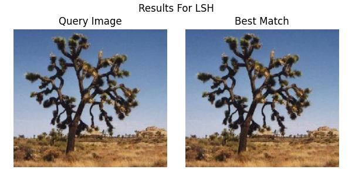
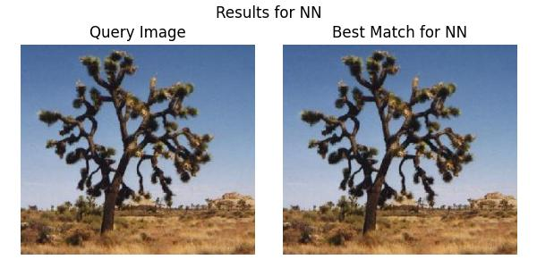

# Lab4-LSH

## 1. 实验概览

本次实验的主要内容是实现局部敏感哈希（LSH）算法，用于解决近似最近邻搜索问题，并与OpenCV-Python中的NN匹配算法进行对比。

LSH实现的主要步骤如下：
  1. 将图像表示为一个12维的整数特征向量，并将特征向量进行量化，使其中每一维的值均为0，1，2中的一个值。
  2. 进行LSH预处理：将特征向量用Hamming码进行表示，并选取特定的投影矩阵，将特征向量投影到低维空间，得到哈希码。
  3. 进行LSH查询：对于查询图像，也进行哈希码的计算，然后在哈希表中查找与查询图像哈希码相似的图像，并从中以欧氏距离为标准选取最相似图像，从而实现近似最近邻搜索。

## 2. 解决思路及关键代码

在这次实验中，吸取了前几次实验的经验，我将LSH算法部分的代码封装在`LSHMatcher`类中，将NN算法的代码封装在`NNMatcher`类中，使得代码更加清晰易懂，也方便了后续的调试和测试。

### 2.1 LSH算法

LSH算法的实现主要分为三个部分：特征提取、哈希码计算和哈希表查询。

#### 2.1.1 特征提取

在`compute_color_histogram`函数中，首先为确保图像的大小不对特征提取造成影响，使用`resize`函数将图像缩放到固定大小，然后将图像分为2x2的网格，计算每个网格的颜色直方图，最后将这四个直方图拼接成一个12维的特征向量。

* 计算颜色直方图：我使用了Lab1中的方法进行计算：
    * 先用`split`函数将图像的三个颜色通道(blue, green, red)分离出来
    * 然后对每个通道的能量进行求和
    * 最后计算每个通道的能量占总能量的比例，作为颜色直方图的特征

关键代码如下：
``````python
def compute_color_histogram(self, image):
    """
    计算12维颜色直方图特征
    将图像分为4个区域，每个区域计算3维颜色直方图 \\
    INPUT:
        image: np.ndarray, 输入图像
    """
    # 将图像调整为相同大小以确保一致性
    image = cv2.resize(image, (200, 200))
    
    # 将图像分为2x2的四个区域
    h, w = image.shape[:2]
    mid_h, mid_w = h//2, w//2
    regions = [
        image[0:mid_h, 0:mid_w],      # 左上
        image[0:mid_h, mid_w:w],      # 右上
        image[mid_h:h, 0:mid_w],      # 左下
        image[mid_h:h, mid_w:w]       # 右下
    ]
    
    # 对每个区域计算3维颜色直方图
    hist_features = []
    for region in regions:
        # 计算颜色直方图
        b, g, r = cv2.split(region)
        b_energy = np.sum(b)
        g_energy = np.sum(g)
        r_energy = np.sum(r)
        total_energy = b_energy + g_energy + r_energy
        hist = [b_energy/total_energy, g_energy/total_energy, r_energy/total_energy]
        hist_features.extend(hist)
        
    return np.array(hist_features)
``````

#### 2.1.2 哈希码计算

首先，使用`_quantize_feature`函数将特征向量量化，使得特征向量每一维的值满足如下条件：
* `0 <= value < 0.3, value = 0`
* `0.3 <= value <= 0.6, value = 1`
* `0.6 < value <= 1, value = 2`

然后，使用`_hash_vector`函数将量化后的特征向量进行哈希码计算，得到一个`12 x 2 = 24`维的Hamming码。并使用投影向量`projection`将特征向量投影到低维空间，得到哈希码。

关键代码如下：
``````python
def _quantize_feature(self, feature):
    """
    将特征向量量化为0,1,2三个值 \\
    INPUT:
        feature: np.ndarray, 特征向量
    """
    quantized = np.zeros_like(feature)
    quantized[feature > 0.6] = 2
    quantized[(feature >= 0.3) & (feature <= 0.6)] = 1
    return quantized

def _hash_vector(self, feature, projection):
    """
    计算特征向量在某个投影集合上的哈希值 \\
    INPUT:
        feature: np.ndarray, 特征向量
        projection: List[ int], 投影集合
    """
    quantized = self._quantize_feature(feature)
    hamming = []
    
    # 计算Hamming码
    for i in range(len(quantized)):
        match quantized[i]:
            case 0:
                hamming.extend([0, 0])
            case 1:
                hamming.extend([1, 0])
            case 2:
                hamming.extend([1, 1])
    hamming = np.array(hamming)
    
    # 投影到低维空间, 计算哈希值
    projected = hamming[projection]

    return tuple(projected)
``````

### 2.1.3 哈希表查询

首先，使用`index_images`函数为所有的数据库中的图像建立索引，建立过程如下：

1. 首先，对于每个图像，计算器特征向量，然后存储其图像路径到`self.image_paths`和特征到`features`数组中，以便于后续的查询和匹配。
2. 然后，对于每个特征向量，使用投影矩阵中的每个投影向量计算其哈希码，将哈希码存储到`self.hash_tables`的哈希表中，以便于后续的查询。其中，哈希表`hash_tables`为一个列表，其中存储的值为字典，`self.hash_tables[table_id]`对应的字典为使用`self.projection_sets[table_id]]`的投影向量计算出的字典。每个字典的键为哈希码，值为一个元组，包含了特征向量在`features`数组中的索引（即其文件名中的索引）以及其特征向量。（这里我选择使用了`collections.defaultdict`来实现哈希表，以便于插入和查询）

然后，使用`query_image`函数对目标图像进行查询，查询过程如下：

1. 读取目标图像，计算其特征向量，然后使用投影矩阵中的每个投影向量计算其哈希码。
2. 对于每个哈希码，从`self.hash_tables`中查询与之相似的哈希码，然后将查询到的特征向量的索引和特征向量存储到`candidates`中。并使用集合`seen_indices`来记录已经查询过的特征向量的索引，以避免重复查询。
3. 对于`candidates`中的特征向量，计算其与目标图像的欧氏距离，选取距离最小的特征向量作为最相似的图像。
4. 在查询过程中，使用`time`库来计算查询时间，以便于后续的性能分析。

关键代码如下：
``````python
def index_images(self, image_dir):
    """
    为图像目录建立索引 \\
    INPUT:
        image_dir: str, 图像目录路径
    """
    self.image_paths = []
    features = []
    
    # 遍历图像目录
    for img_path in Path(image_dir).glob('*'):
        if img_path.suffix.lower() in ['.jpg']:
            try:
                # 读取图像
                img = cv2.imread(str(img_path))
                if img is None:
                    continue
                    
                # 计算特征
                feature = self.compute_color_histogram(img)
                
                # 存储图像路径和特征
                self.image_paths.append(str(img_path))
                features.append(feature)
            except Exception as e:
                print(f"Error processing {img_path}: {e}")
                
    # 建立索引
    for idx, feature in enumerate(features):
        for table_id, projection in enumerate(self.projection_sets):
            hash_val = self._hash_vector(feature, projection)
            self.hash_tables[table_id][hash_val].append((idx, feature))

def query_image(self, query_img_path, k=1):
    """
    查询与输入图像最相似的k张图像 \\
    INPUT:
        query_img_path: str, 查询图像路径
        k: int, 返回的匹配图像数量，默认为1，返回最相似的图像
    OUTPUT:
            List[ str], 最相似的k张图像的路径
            search_time: float, 查询时间
        """
    # 记录开始时间
    start_time = time.time()

    # 读取查询图像
    query_img = cv2.imread(query_img_path)
    if query_img is None:
        raise ValueError("Cannot read query image")
        
    # 计算查询图像的特征
    query_feature = self.compute_color_histogram(query_img)
    
    # 在哈希表中查找候选项
    candidates = [] 
    seen_indices = set()  # 用于追踪已经见过的索引
    
    # 在每个哈希表中查找
    for table_id, projection in enumerate(self.projection_sets):
        hash_val = self._hash_vector(query_feature, projection)
        # 获取该哈希值对应的所有候选项
        for idx, feature in self.hash_tables[table_id][hash_val]:
            # 只添加还没见过的索引
            if idx not in seen_indices:
                candidates.append((idx, feature))
                seen_indices.add(idx)
            
    if not candidates:
        return []
        
    # 计算距离并排序
    distances = []
    for idx, feature in candidates:
        dist = np.sum((feature - query_feature) ** 2)
        distances.append((dist, idx))
        
    # 返回最相似的k张图像的路径
    distances.sort()

    # 记录结束时间
    end_time = time.time()
    search_time = end_time - start_time

    return [self.image_paths[idx] for _, idx in distances[:k]], search_time
``````

### 2.2 NN算法

在`NNMatcher`类中，我实现了一个简单的NN算法，用于与LSH算法进行对比。

与LSH算法不同，NN算法不需要进行哈希码的计算和查询，只需要计算目标图像的特征向量与数据库中所有图像的特征向量的欧氏距离，然后选取距离最小的图像作为最相似的图像。

计算特征向量及给数据库中的图像建立索引的过程与LSH算法相同，在查询过程中，只需要使用`np.sum`函数计算欧氏距离，然后选取距离最小的图像作为最相似的图像即可。同样地，使用`time`模块来计算查询时间。

关键代码如下：
``````python
def compute_color_histogram(self, image):
    """
    计算12维颜色直方图特征
    将图像分为4个区域，每个区域计算3维颜色直方图 \\
    INPUT:
        image: np.ndarray, 输入图像
    """
    # 将图像调整为相同大小以确保一致性
    image = cv2.resize(image, (200, 200))
    
    # 将图像分为2x2的四个区域
    h, w = image.shape[:2]
    mid_h, mid_w = h//2, w//2
    regions = [
        image[0:mid_h, 0:mid_w],      # 左上
        image[0:mid_h, mid_w:w],      # 右上
        image[mid_h:h, 0:mid_w],      # 左下
        image[mid_h:h, mid_w:w]       # 右下
    ]
    
    # 对每个区域计算3维颜色直方图
    hist_features = []
    for region in regions:
        # 计算颜色直方图
        b, g, r = cv2.split(region)
        b_energy = np.sum(b)
        g_energy = np.sum(g)
        r_energy = np.sum(r)
        total_energy = b_energy + g_energy + r_energy
        hist = [b_energy/total_energy, g_energy/total_energy, r_energy/total_energy]
        hist_features.extend(hist)
        
    return np.array(hist_features)

def index_images(self, image_dir):
    """
    为图像目录建立索引
    """
    image_dir = Path(image_dir)
    
    for img_path in image_dir.glob('*'):
        if img_path.suffix.lower() in ['.jpg']:
            try:
                # 读取图像
                img = cv2.imread(str(img_path))
                if img is None:
                    continue
                
                # 计算特征
                feature = self.compute_color_histogram(img)
                
                self.image_paths.append(str(img_path))
                self.features.append(feature)
                
            except Exception as e:
                print(f"Error processing {img_path}: {e}")
    
    # 将特征列表转换为numpy数组，便于后续计算
    self.features = np.array(self.features)
    
def query_image(self, query_img_path, k=1):
    """
    使用NN算法查找最相似的k张图像
    """
    # 记录开始时间
    start_time = time.time()
    
    # 读取查询图像
    query_img = cv2.imread(query_img_path)
    if query_img is None:
        raise ValueError("Cannot read query image")
        
    # 计算查询图像的特征
    query_feature = self.compute_color_histogram(query_img)
    
    # 计算与所有图像的距离
    distances = np.sum((self.features - query_feature) ** 2, axis=1)
    
    # 获取前k个最小距离的索引
    nearest_indices = np.argsort(distances)[:k]
    
    # 记录结束时间
    end_time = time.time()
    search_time = end_time - start_time
    
    # 返回最相似图像的路径和搜索时间
    return [self.image_paths[i] for i in nearest_indices], search_time
``````

## 3. 实验结果及分析

### 3.1 实验结果

在实验中，使用`img`目录下的图像作为数据库，使用`target.jpg`作为查询图像，分别使用LSH算法和NN算法进行查询，得到的结果如下：

* LSH算法查询结果：
    1. 搜索时间：0.0008852481842041016 s
    
    2. 查询结果：
    
       
    
* NN算法查询结果：
    1. 搜索时间：0.0006673336029052734 s
    
    2. 查询结果：
    
       

### 3.2 实验分析

从实验结果中可以看出，LSH算法与NN算法都能够找到与目标图像最相似的图像，但是在搜索时间上，NN算法的搜索时间更短。这可能是因为数据库中的图像数量较少，LSH算法的哈希表查询时间较长，而NN算法只需要计算欧氏距离，因此搜索时间更短。如果数据库中的图像数量较多，LSH算法的优势可能会更加明显。

### 3.3 因素分析

#### 3.3.1 投影集合

1. 投影集合的大小：

    1. 当投影集合的大小较小时，哈希码的维度较低，可能会导致哈希码的冲突较多，从而影响查询的准确性。但是在数据库中的图像数量较少时，哈希码的冲突产生的可能性不大，因此查询结果还可以保持较高的准确性。
    2. 当投影集合的大小较大时，哈希码的维度较高，可能会导致哈希码的冲突较少，但是查询的时间会增加。

2. 投影集合中的投影向量：

    投影向量的选择会影响哈希码的计算，不同的投影向量可能会导致哈希码的冲突不同，从而影响查询的准确性。但是当投影向量的数量较多时，哈希码的冲突较少，查询的准确性会更高。并且在投影集合较大时，投影向量中的数值选择的影响可能会更小。

以上分析均基于理论分析，实际效果可能会有所不同。在这次实验中，由于数据库中的图像数量较少，因此投影集合的大小对查询结果和运行时间的影响不会太大。

#### 3.3.2 运行时间分析

在这次实验中，我使用了`time`模块来计算查询时间，但是由于查询时间较短，我通过运行多次查询来计算平均查询时间，以减小误差。最终得到的结果如下：

* 在运行1000次查询后
    * LSH算法的平均查询时间为：0.0009086077213287353 s
    * NN算法的平均查询时间为：0.0007708735466003417 s

从结果中可以看出，LSH算法的查询时间较长，可能是因为哈希表查询的时间较长，而NN算法的查询时间较短，可能是因为只需要计算欧氏距离，并且数据库中的图像数量较少。

如果数据库中的图像数量较多，LSH算法的优势可能会更加明显，因为哈希表查询的时间会随着数据库中的图像数量的增加而减少，而NN算法的查询时间会随着数据库中的图像数量的增加而增加。

### 3.4 总结

在这次实验中，我实现了LSH算法和NN算法，并使用这两种算法进行了近似最近邻搜索。通过实验结果的分析，我发现LSH算法和NN算法都能够找到与目标图像最相似的图像，但是在搜索时间上，NN算法的搜索时间更短。这可能是因为数据库中的图像数量较少，LSH算法的哈希表查询时间较长，而NN算法只需要计算欧氏距离，因此搜索时间更短。如果数据库中的图像数量较多，LSH算法的优势可能会更加明显。

## 4. 心得体会

### 4.1 思考题

1. 本练习中使用了颜色直方图特征信息，检索效果符合你的预期吗？检索出的图像与输入图像的相似性体现在哪里？

    * 检索效果符合预期
    * 相似性体现在颜色直方图的相似性，即颜色直方图的能量分布相似，从视觉上看就是目标图像与匹配图象个在四块分区上的色调分别相似

2. 能否设计其他的特征？

    * 可以使用其他特征：如梯度直方图、SIFT特征等。

3. 哈希函数计算中的 $x_i$ 是什么？

    * $x_i$ 是特征向量中的第 $i$ 维特征值，经过量化后的值。

### 4.2 心得体会

在这次实验中，我实现了LSH算法和NN算法，并使用这两种算法进行了图像搜索。通过实验结果的分析，我发现LSH算法和NN算法都能够找到与目标图像最相似的图像，但是在搜索时间上，NN算法的搜索时间更短。这可能是因为数据库中的图像数量较少，LSH算法的哈希表查询时间较长，而NN算法只需要计算欧氏距离，因此搜索时间更短。如果数据库中的图像数量较多，LSH算法的优势可能会更加明显。

通过这次实验，我学习了LSH算法的实现方法，了解了哈希表的构建和查询过程，也学会了如何使用颜色直方图特征进行图像匹配。通过与NN算法的对比，我进一步了解了LSH算法的优势和不足。

在实验过程中，我也遇到了一些问题，如哈希表的构建和查询过程，以及特征的提取和量化，但是通过查阅文档和调试，最终解决了这些问题。通过这次实验，我对LSH算法有了更深入的理解，也提高了自己的编程和调试能力。

## 5. 附录：代码

`Matcher.py`

``````python
import cv2
import time
import numpy as np
import matplotlib.pyplot as plt
from pathlib import Path
from collections import defaultdict

class LSHMatcher:
    def __init__(self, projection_sets):
        """
        初始化LSH \\
        projection_sets: List[ List[ int]], 投影集合的列表
        """
        self.projection_sets = projection_sets
        self.hash_tables = [defaultdict(list) for _ in range(len(projection_sets))]
        
    def compute_color_histogram(self, image):
        """
        计算12维颜色直方图特征
        将图像分为4个区域，每个区域计算3维颜色直方图 \\
        INPUT:
            image: np.ndarray, 输入图像
        """
        # 将图像调整为相同大小以确保一致性
        image = cv2.resize(image, (200, 200))
        
        # 将图像分为2x2的四个区域
        h, w = image.shape[:2]
        mid_h, mid_w = h//2, w//2
        regions = [
            image[0:mid_h, 0:mid_w],      # 左上
            image[0:mid_h, mid_w:w],      # 右上
            image[mid_h:h, 0:mid_w],      # 左下
            image[mid_h:h, mid_w:w]       # 右下
        ]
        
        # 对每个区域计算3维颜色直方图
        hist_features = []
        for region in regions:
            # 计算颜色直方图
            b, g, r = cv2.split(region)
            b_energy = np.sum(b)
            g_energy = np.sum(g)
            r_energy = np.sum(r)
            total_energy = b_energy + g_energy + r_energy
            hist = [b_energy/total_energy, g_energy/total_energy, r_energy/total_energy]
            hist_features.extend(hist)
            
        return np.array(hist_features)
    
    def _quantize_feature(self, feature):
        """
        将特征向量量化为0,1,2三个值 \\
        INPUT:
            feature: np.ndarray, 特征向量
        """
        quantized = np.zeros_like(feature)
        quantized[feature > 0.6] = 2
        quantized[(feature >= 0.3) & (feature <= 0.6)] = 1
        return quantized
    
    def _hash_vector(self, feature, projection):
        """
        计算特征向量在某个投影集合上的哈希值 \\
        INPUT:
            feature: np.ndarray, 特征向量
            projection: List[ int], 投影集合
        """
        quantized = self._quantize_feature(feature)
        hamming = []
        
        # 计算Hamming码
        for i in range(len(quantized)):
            match quantized[i]:
                case 0:
                    hamming.extend([0, 0])
                case 1:
                    hamming.extend([1, 0])
                case 2:
                    hamming.extend([1, 1])

        hamming = np.array(hamming)
        projected = hamming[projection]
        return tuple(projected)
    
    def index_images(self, image_dir):
        """
        为图像目录建立索引 \\
        INPUT:
            image_dir: str, 图像目录路径
        """
        self.image_paths = []
        features = []
        
        # 遍历图像目录
        for img_path in Path(image_dir).glob('*'):
            if img_path.suffix.lower() in ['.jpg']:
                try:
                    # 读取图像
                    img = cv2.imread(str(img_path))
                    if img is None:
                        continue
                        
                    # 计算特征
                    feature = self.compute_color_histogram(img)
                    
                    # 存储图像路径和特征
                    self.image_paths.append(str(img_path))
                    features.append(feature)
                except Exception as e:
                    print(f"Error processing {img_path}: {e}")
                    
        # 建立索引
        for idx, feature in enumerate(features):
            for table_id, projection in enumerate(self.projection_sets):
                hash_val = self._hash_vector(feature, projection)
                self.hash_tables[table_id][hash_val].append((idx, feature))
    
    def query_image(self, query_img_path, k=1):
        """
        查询与输入图像最相似的k张图像 \\
        INPUT:
            query_img_path: str, 查询图像路径
            k: int, 返回的匹配图像数量
        OUTPUT:
            List[ str], 最相似的k张图像的路径
            search_time: float, 查询时间
        """
        # 记录开始时间
        start_time = time.time()

        # 读取查询图像
        query_img = cv2.imread(query_img_path)
        if query_img is None:
            raise ValueError("Cannot read query image")
            
        # 计算查询图像的特征
        query_feature = self.compute_color_histogram(query_img)
        
        # 在哈希表中查找候选项
        candidates = [] 
        seen_indices = set()  # 用于追踪已经见过的索引
        
        # 在每个哈希表中查找
        for table_id, projection in enumerate(self.projection_sets):
            hash_val = self._hash_vector(query_feature, projection)
            # 获取该哈希值对应的所有候选项
            for idx, feature in self.hash_tables[table_id][hash_val]:
                # 只添加还没见过的索引
                if idx not in seen_indices:
                    candidates.append((idx, feature))
                    seen_indices.add(idx)
                
        if not candidates:
            return []
            
        # 计算距离并排序
        distances = []
        for idx, feature in candidates:
            dist = np.sum((feature - query_feature) ** 2)
            distances.append((dist, idx))
            
        # 返回最相似的k张图像的路径
        distances.sort()

        # 记录结束时间
        end_time = time.time()
        search_time = end_time - start_time

        return [self.image_paths[idx] for _, idx in distances[:k]], search_time
    
    def visualize_results(self, query_img_path, result_paths, save_path=None):
        """
        可视化查询结果 \\
        INPUT:
            query_img_path: str, 查询图像路径
            result_paths: List[ str], 结果图像路径列表
            save_path: str, 可选, 保存图像路径
        """
        # 读取并调整查询图像大小
        query_img = cv2.imread(query_img_path)
        
        # 读取并调整结果图像大小
        result_imgs = []
        for path in result_paths:
            img = cv2.imread(path)
            result_imgs.append(img)
        
        plt.figure(figsize=(6, 3))
        plt.subplot(1, 2, 1)
        plt.imshow(cv2.cvtColor(query_img, cv2.COLOR_BGR2RGB))
        plt.title('Query Image')
        plt.axis('off')

        plt.subplot(1, 2, 2)
        plt.imshow(cv2.cvtColor(result_imgs[0], cv2.COLOR_BGR2RGB))
        plt.title('Best Match')
        plt.axis('off')
        
        plt.suptitle('Results For LSH')
        plt.tight_layout()

        if save_path is not None:
            plt.savefig(save_path)
        else:
            plt.show()

class NNMatcher:
    def __init__(self):
        self.image_paths = []
        self.features = []
        
    def compute_color_histogram(self, image):
        """
        计算12维颜色直方图特征
        将图像分为4个区域，每个区域计算3维颜色直方图 \\
        INPUT:
            image: np.ndarray, 输入图像
        """
        # 将图像调整为相同大小以确保一致性
        image = cv2.resize(image, (200, 200))
        
        # 将图像分为2x2的四个区域
        h, w = image.shape[:2]
        mid_h, mid_w = h//2, w//2
        regions = [
            image[0:mid_h, 0:mid_w],      # 左上
            image[0:mid_h, mid_w:w],      # 右上
            image[mid_h:h, 0:mid_w],      # 左下
            image[mid_h:h, mid_w:w]       # 右下
        ]
        
        # 对每个区域计算3维颜色直方图
        hist_features = []
        for region in regions:
            # 计算颜色直方图
            b, g, r = cv2.split(region)
            b_energy = np.sum(b)
            g_energy = np.sum(g)
            r_energy = np.sum(r)
            total_energy = b_energy + g_energy + r_energy
            hist = [b_energy/total_energy, g_energy/total_energy, r_energy/total_energy]
            hist_features.extend(hist)
            
        return np.array(hist_features)

    def index_images(self, image_dir):
        """
        为图像目录建立索引
        """
        image_dir = Path(image_dir)
        
        for img_path in image_dir.glob('*'):
            if img_path.suffix.lower() in ['.jpg']:
                try:
                    # 读取图像
                    img = cv2.imread(str(img_path))
                    if img is None:
                        continue
                    
                    # 计算特征
                    feature = self.compute_color_histogram(img)
                    
                    self.image_paths.append(str(img_path))
                    self.features.append(feature)
                    
                except Exception as e:
                    print(f"Error processing {img_path}: {e}")
        
        # 将特征列表转换为numpy数组，便于后续计算
        self.features = np.array(self.features)
        
    def query_image(self, query_img_path, k=1):
        """
        使用NN算法查找最相似的k张图像
        """
        # 记录开始时间
        start_time = time.time()
        
        # 读取查询图像
        query_img = cv2.imread(query_img_path)
        if query_img is None:
            raise ValueError("Cannot read query image")
            
        # 计算查询图像的特征
        query_feature = self.compute_color_histogram(query_img)
        
        # 计算与所有图像的距离
        distances = np.sum((self.features - query_feature) ** 2, axis=1)
        
        # 获取前k个最小距离的索引
        nearest_indices = np.argsort(distances)[:k]
        
        # 记录结束时间
        end_time = time.time()
        search_time = end_time - start_time
        
        # 返回最相似图像的路径和搜索时间
        return [self.image_paths[i] for i in nearest_indices], search_time
    
    def visualize_results(self, query_img_path, result_paths, save_path=None):
        """
        可视化查询结果 \\
        INPUT:
            query_img_path: str, 查询图像路径
            result_paths: List[ str], 结果图像路径列表
            save_path: str, 可选, 保存图像路径
        """
        # 读取并调整查询图像大小
        query_img = cv2.imread(query_img_path)
        
        # 读取并调整结果图像大小
        result_imgs = []
        for path in result_paths:
            img = cv2.imread(path)
            result_imgs.append(img)
        
        plt.figure(figsize=(6, 3))
        plt.subplot(1, 2, 1)
        plt.imshow(cv2.cvtColor(query_img, cv2.COLOR_BGR2RGB))
        plt.title('Query Image')
        plt.axis('off')

        plt.subplot(1, 2, 2)
        plt.imshow(cv2.cvtColor(result_imgs[0], cv2.COLOR_BGR2RGB))
        plt.title('Best Match')
        plt.axis('off')
        
        plt.suptitle('Results For NN')
        plt.tight_layout()

        if save_path is not None:
            plt.savefig(save_path)
        else:
            plt.show()
``````

`lab4.py`

``````python
import os
from Matcher import LSHMatcher, NNMatcher

def analyze_projection_set(projection_sets, database_path, target_path, query_image_path, output_path):
    print("分析投影集合的影响：")
    for i, projection_set in enumerate(projection_sets):
        print(f"第{i+1}个投影集合：")

        # LSH
        lsh = LSHMatcher(projection_set)
        lsh.index_images(database_path)
        results, query_time_LSH = lsh.query_image(query_image_path, k=1)
        lsh.visualize_results(query_image_path, results, save_path=os.path.join(output_path, f"lsh_results_{i+1}.jpg"))

        # NN
        matcher = NNMatcher()
        matcher.index_images(database_path)
        matcher_results, query_time_NN = matcher.query_image(query_image_path, k=1)
        matcher.visualize_results(query_image_path, matcher_results, save_path=os.path.join(output_path, f"nn_results_{i+1}.jpg"))

        print(f"运行时间：")
        print(f"LSH: {query_time_LSH} s")
        print(f"NN: {query_time_NN} s")

        with open(os.path.join(output_path, f"time_projection_set_size.txt"), "a") as f:
            f.write(f"No.{i+1} Projection set: \n")
            f.write(f"LSH: {query_time_LSH} s\n")
            f.write(f"NN: {query_time_NN} s\n")

def analyze_time(projection_set, max_iter, database_path, target_path, query_image_path, output_path):
    print("分析运行时间：")
    LSH_time = 0
    NN_time = 0
    for i in range(max_iter):
        # LSH
        lsh = LSHMatcher(projection_set)
        lsh.index_images(database_path)
        results, query_time_LSH = lsh.query_image(query_image_path, k=1)
        LSH_time += query_time_LSH

        # NN
        matcher = NNMatcher()
        matcher.index_images(database_path)
        matcher_results, query_time_NN = matcher.query_image(query_image_path, k=1)
        NN_time += query_time_NN
    
    LSH_time /= max_iter
    NN_time /= max_iter

    print(f"平均运行时间：")
    print(f"LSH: {LSH_time} s")
    print(f"NN: {NN_time} s")

if "__main__" == __name__:
    # 定义投影集合
    # index range: 0 ~ 23
    projection_sets = [
        [0, 3, 6, 9, 23, 19],    # 第一个投影集合
        [1, 4, 7, 10, 16, 17],   # 第二个投影集合
        [2, 5, 8, 11, 12, 20]    # 第三个投影集合
    ]

    projection_sets_size = [
        [
            [0, 1, 2, 3, 4, 5, 6, 7, 8, 9, 10, 11, 12, 13, 14, 15, 16, 17, 18, 19, 20, 21, 22, 23]
        ],
        [
            [0, 1, 2, 3, 4, 5, 6, 7, 8, 9, 10, 11, 12],
            [13, 14, 15, 16, 17, 18, 19, 20, 21, 22, 23, 0, 1],
        ],
        [
            [0, 1, 2, 3, 4, 5, 6, 7, 8, 9],
            [10, 11, 12, 13, 14, 15, 16, 17, 18, 19],
            [20, 21, 22, 23, 0, 1, 2, 3, 4, 5]
        ],
        [
            [0, 1, 2, 3, 4, 5, 6, 7, 8],
            [9, 10, 11, 12, 13, 14, 15, 16, 17],
            [18, 19, 20, 21, 22, 23, 0, 1, 2]
        ],
        [
            [0, 3, 6, 9, 23, 19, 13],
            [1, 4, 7, 10, 16, 17, 14],
            [2, 5, 8, 11, 12, 20, 15]
        ],
        [
            [0, 3, 6, 9, 23, 19],
            [1, 4, 7, 10, 16, 17],
            [2, 5, 8, 11, 12, 20]
        ],
        [
            [0, 3, 6, 9, 23],
            [1, 4, 7, 10, 16],
            [2, 5, 8, 11, 12]
        ],
        [
            [0, 3, 6, 9],
            [1, 4, 7, 10],
            [2, 5, 8, 11]
        ],
        [
            [0, 3, 6],
            [1, 4, 7],
            [2, 5, 8]
        ],
        [
            [0, 3],
            [1, 4],
            [2, 5]
        ],
        [
            [0],
            [1],
            [2]
        ],
        [
            [0],
            [1]
        ],
        [
            [0]
        ]
    ]

    projection_sets_index = [
        [
            [0, 1, 2, 3, 4],
            [5, 6, 7, 8, 9],
            [10, 11, 12, 13, 14],
            [15, 16, 17, 18, 19],
            [20, 21, 22, 23, 0]
        ],
        [
            [0, 3, 6, 9, 12],
            [1, 4, 7, 10, 13],
            [2, 5, 8, 11, 14],
            [15, 18, 21, 0, 16],
            [19, 22, 20, 23, 17]
        ],
        [
            [0, 23, 22, 21, 20],
            [19, 18, 17, 16, 15],
            [14, 13, 12, 11, 10],
            [9, 8, 7, 6, 5],
            [4, 3, 2, 1, 0]
        ], 
        [
            [1, 2, 3],
            [4, 5, 6],
            [7, 8, 9],
            [10, 11, 12],
            [13, 14, 15],
            [16, 17, 18],
            [19, 20, 21],
            [22, 23, 0]
        ],
        [
            [0, 1],
            [2, 3],
            [4, 5],
            [6, 7],
            [8, 9],
            [10, 11],
            [12, 13],
            [14, 15],
            [16, 17],
            [18, 19],
            [20, 21],
            [22, 23],
        ],
        [
            [0],
            [1],
            [2],
            [3],
            [4],
            [5],
            [6],
            [7],
            [8],
            [9],
            [10],
            [11],
            [12],
            [13],
            [14],
            [15],
            [16],
            [17],
            [18],
            [19],
            [20],
            [21],
            [22],
            [23],
        ]
    ]

    # 设置路径
    path_to_dir = os.path.dirname(__file__)
    path_to_database = os.path.join(path_to_dir, "img")
    path_to_target = os.path.join(path_to_dir, "target.jpg")
    
    image_dir = path_to_database
    query_image_path = path_to_target
    
    output = os.path.join(path_to_dir, "output")
    os.makedirs(output, exist_ok=True)

    # LSH
    # 创建LSH实例
    lsh = LSHMatcher(projection_sets)
    # 建立图像数据库索引
    lsh.index_images(image_dir)
    # 查询图像
    results, query_time_LSH = lsh.query_image(query_image_path, k=1)
    # 可视化结果
    lsh.visualize_results(query_image_path, results, save_path=os.path.join(output, "lsh_results.jpg"))

    # NN
    # 创建Matcher实例
    matcher = NNMatcher()
    # 建立图像数据库索引
    matcher.index_images(image_dir)
    # 查询图像
    matcher_results, query_time_NN = matcher.query_image(query_image_path, k=1)
    # 可视化结果
    matcher.visualize_results(query_image_path, matcher_results, save_path=os.path.join(output, "nn_results.jpg"))

    print("运行时间：")
    with open(os.path.join(output, "time.txt"), "w") as f:
        f.write(f"LSH: {query_time_LSH} s\n")
        f.write(f"NN: {query_time_NN} s\n")
    print(f"LSH: {query_time_LSH} s")
    print(f"NN: {query_time_NN} s")
    print("结果已保存至output文件夹")

    # 分析投影集合的影响
    analyze_projection_set(projection_sets_size, image_dir, path_to_target, query_image_path, output)

    # 分析运行时间
    N = 1000
    analyze_time(projection_sets, N, image_dir, path_to_target, query_image_path, output)
``````